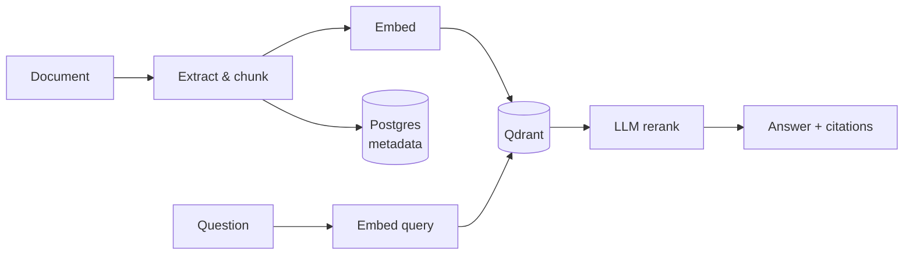
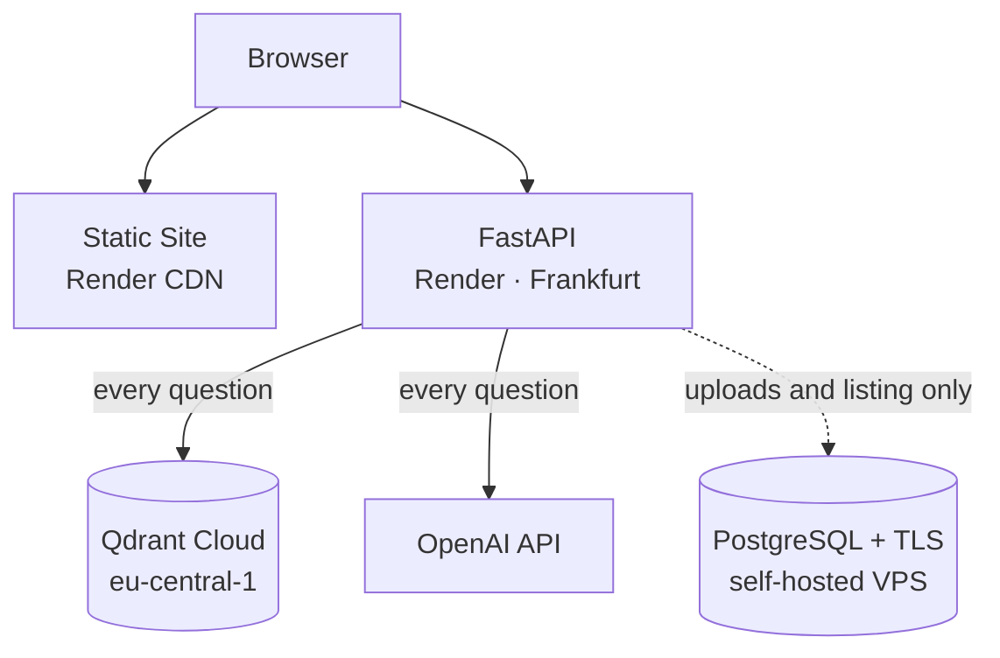

# Enterprise RAG

A production-minded Retrieval-Augmented Generation service. Upload documents, index them as vector embeddings, and ask grounded questions that answer **only** from the retrieved text — with inspectable citations, token-by-token streaming, and a deployed multi-cloud footprint.

**[Live demo →](https://enterprise-rag-static-site.onrender.com)** · [API docs](https://enterprise-rag-zkot.onrender.com/docs) · [Deployment guide](DEPLOYMENT.md)

> The API runs on a free tier that sleeps after 15 minutes idle. The first request
> may take 50–90 seconds while it wakes; the page itself loads instantly, so it can
> look like it has hung. Warm it first with
> [`/healthz`](https://enterprise-rag-zkot.onrender.com/healthz).
>
> The demo is intentionally unauthenticated and the document library is shared —
> please don't upload anything confidential.

---

## What it does



Retrieval is deliberately conservative: candidates are pulled by cosine similarity, filtered by a score threshold, reranked by a fast LLM call, and only then passed to the answering model as **evidence rather than instructions**. If nothing clears the threshold, the service says so instead of inventing an answer.

## Features

- **Grounded answers with citations** — every response is traceable to a filename and page
- **LLM reranking** — retrieves `TOP_K` candidates, keeps the best `RERANK_K`
- **Score-threshold filtering** — weak matches never reach the answering model
- **SSE streaming** — tokens arrive as they're generated, citations as a final event
- **Content-hash deduplication** — re-uploading the same bytes re-indexes rather than duplicating; a renamed file is not new work
- **Idempotent vector writes** — deterministic point IDs (UUIDv5) mean a retried upsert updates rather than duplicates
- **Asynchronous ingestion** — Celery workers index large documents outside the request cycle, with the API falling back to synchronous ingestion when no broker is configured
- **Prompt-injection defense** — input filtering at the boundary, plus a system prompt that treats retrieved excerpts as data
- **Graceful degradation** — a vector-store outage returns `503`, not a `500`

## Tech stack

| Layer | Technology |
|---|---|
| **API** | Python 3.12, FastAPI, Uvicorn, Pydantic v2 |
| **LLM & embeddings** | OpenAI `gpt-4o-mini`, `text-embedding-3-small` |
| **Vector store** | Qdrant (cosine similarity, payload-indexed filtering) |
| **Relational store** | PostgreSQL 16 + SQLAlchemy 2.x |
| **Task queue** | Celery 5.x, Redis broker |
| **Frontend** | Angular 22, TypeScript 6, SCSS |
| **Document parsing** | pypdf, python-docx |
| **Infrastructure** | Docker, Docker Compose, Nginx, Caddy |
| **Quality** | pytest, httpx, Ruff |

## Deployment

The live deployment spans three providers, split along one line: **whatever sits in the hot path of a question stays next to the API; everything else can be remote.**



| Component | Host | Rationale |
|---|---|---|
| Frontend | Render Static Site | Consumes zero instance-hours and never sleeps |
| API | Render Web Service (Docker), Frankfurt | Co-located with Qdrant, which every query hits |
| Vectors | Qdrant Cloud, `eu-central-1` | Managed, and in the latency-critical path |
| Metadata | PostgreSQL on a self-hosted VPS | Render's free database is deleted after 30 days; this one isn't |
| LLM | OpenAI | — |

**Why Postgres is remote but Qdrant is not.** The `/v1/query` endpoints take no database dependency at all — answering a question touches only Qdrant and OpenAI. Postgres is read and written solely by document CRUD, which is infrequent and tolerant of a cross-network hop. That asymmetry is what makes a free, permanent deployment possible without putting latency in front of users.

Notable hardening in the deployed configuration:

- Postgres accepts **TLS-only** connections and its firewall is scoped to Render's published egress ranges rather than the open internet
- The container binds the platform-assigned `$PORT` and `exec`s the server as PID 1, so it receives `SIGTERM` and shuts down gracefully on redeploy
- Managed `postgres://` URLs are normalized to psycopg 3 at startup, preserving query parameters such as `sslmode`
- CORS origins are environment-driven, since the static frontend is a separate origin from the API

Full step-by-step instructions, including the trade-offs and the failure modes worth knowing about, are in **[DEPLOYMENT.md](DEPLOYMENT.md)**. To run the entire stack on a single server instead — no cold starts, Celery worker included — see **[docs/self-hosting.md](docs/self-hosting.md)**.

### Known limitations of the free-tier demo

| Limitation | Consequence |
|---|---|
| API sleeps after 15 min idle | 50–90 s cold start on the first request |
| No background worker on Render's free tier | Ingestion runs inside the request; uploads capped at 4 MB |
| Free Qdrant clusters suspend when idle | Retrieval fails with `503` until reactivated; a weekly keep-alive mitigates it |
| No authentication | Anyone can upload, query, and delete — deliberate for a demo, unsuitable for real data |

## Quick start

### Docker Compose

```bash
cp .env.example .env      # add your OPENAI_API_KEY
docker compose up --build
```

Open <http://localhost:4200>. Nginx proxies `/v1/` to the API, so the browser sees a single origin and CORS never applies. This stack includes Postgres, Qdrant, Redis, and the Celery worker — the full asynchronous ingestion path.

### Local development

```powershell
python -m venv .venv
.\.venv\Scripts\Activate.ps1
pip install -e '.[dev]'
cp .env.example .env
docker compose up -d qdrant postgres redis
uvicorn enterprise_rag.main:app --reload
```

```bash
cd web && npm install && npm start
```

## API

Interactive OpenAPI docs are at [`/docs`](https://enterprise-rag-zkot.onrender.com/docs).

```bash
# Upload a document (.pdf, .docx, .txt, .md)
curl -X POST http://127.0.0.1:8000/v1/documents -F "file=@policy.pdf"

# Ask a grounded question
curl -X POST http://127.0.0.1:8000/v1/query \
  -H "Content-Type: application/json" \
  -d '{"question":"What is the retention policy?"}'

# Stream the answer token by token
curl -X POST http://127.0.0.1:8000/v1/query/stream \
  -H "Content-Type: application/json" \
  -d '{"question":"What is the retention policy?"}'

# List, inspect, delete
curl http://127.0.0.1:8000/v1/documents
curl http://127.0.0.1:8000/v1/documents/{id}
curl -X DELETE http://127.0.0.1:8000/v1/documents/{id}
```

An upload returns `201` immediately with status `processing` when a Celery broker is configured, and the frontend polls until the document reports `indexed`.

## Testing

```bash
pytest          # 9 tests
ruff check src tests
```

## Project structure

```
src/enterprise_rag/
  api/routes.py            HTTP endpoints
  services/
    rag.py                 Retrieval, reranking, answer generation
    vector_store.py        Qdrant repository with retry and idempotent writes
    embeddings.py          OpenAI embedding client
    chunking.py            Page-aware text chunking
    document_loader.py     PDF / DOCX / text extraction
    tasks.py               Celery background ingestion
  config.py                Environment-validated settings
  database.py              SQLAlchemy engine and URL normalization
web/                       Angular frontend
deploy/vps-postgres.yml    TLS-enabled Postgres for a self-hosted database
docker-compose.yml         Local development stack
docker-compose.prod.yml    Single-server production stack
tests/                     pytest suite
```

## Documentation

- **[Deployment guide](DEPLOYMENT.md)** — the live multi-cloud setup, step by step
- **[Self-hosting](docs/self-hosting.md)** — the whole stack on one server
- [Architecture](docs/architecture.md)
- [Sequence diagrams](docs/sequence-diagrams.md)
- [Evaluation](docs/evaluation.md)
- [Production readiness](docs/production-readiness.md)

## Before using this with real data

This project is a public demo and is explicit about it. Prior to handling anything confidential:

- Add authentication and per-user authorization — the library is currently shared and world-writable
- Move secrets into a managed secret store; never commit `.env`
- Enforce rate limits and request-size caps at the edge
- Replace `create_all` with managed migrations (Alembic)
- Issue a CA-signed certificate for Postgres — the deployed one is self-signed, which stops passive interception but not an active man-in-the-middle
- Configure backups and monitoring for both Qdrant and Postgres
- Run an evaluation set before shipping retrieval or prompt changes
