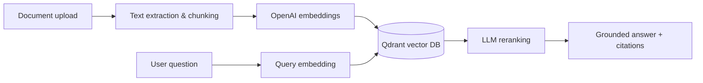

# Enterprise RAG

A production-grade Retrieval-Augmented Generation service. Upload documents, index them as vector embeddings, and ask grounded questions with page-level citations — all through a modern web interface or REST API.

## Tech Stack

| Layer | Technology |
|-------|-----------|
| **Backend API** | Python 3.12, FastAPI, Uvicorn, Pydantic |
| **LLM & Embeddings** | OpenAI GPT-4o-mini, text-embedding-3-small |
| **Vector Database** | Qdrant (cosine similarity search) |
| **Relational Database** | PostgreSQL 16 (document metadata, deduplication) |
| **Task Queue** | Celery 5.x with Redis broker |
| **Frontend** | Angular 19, TypeScript, SCSS |
| **Containerization** | Docker, Docker Compose |
| **Web Server** | Nginx (reverse proxy, SPA routing, SSE support) |
| **PDF Parsing** | pypdf |
| **DOCX Parsing** | python-docx |
| **ORM** | SQLAlchemy 2.x |
| **Testing** | pytest, httpx |
| **Linting** | Ruff |

## Architecture



## Key Features

- **Semantic search** with cosine similarity and LLM-based reranking
- **Content-hash deduplication** — re-uploading the same file re-indexes with latest chunking config
- **Score threshold filtering** — only chunks above a relevance threshold reach the LLM
- **SSE streaming** — token-by-token response streaming to the frontend
- **Background indexing** — Celery workers handle large documents asynchronously
- **Prompt injection defense** — input filtering + system prompt treats excerpts as data
- **Audit logging** — every query and ingestion is logged with request IDs
- **Deterministic point IDs** — idempotent Qdrant upserts with retry logic

## Quick Start

### Docker Compose (recommended)

```bash
cp .env.example .env
# Add OPENAI_API_KEY to .env
docker compose up --build
```

Open `http://localhost:4200` — upload a document, then ask questions.

### Local development

```powershell
python -m venv .venv
.\.venv\Scripts\Activate.ps1
pip install -e '.[dev]'
cp .env.example .env
# Add OPENAI_API_KEY to .env
docker compose up -d qdrant postgres redis
uvicorn enterprise_rag.main:app --reload
```

For the Angular frontend:

```bash
cd web
npm install
npm start
```

## API Examples

```bash
# Upload a document
curl -X POST http://127.0.0.1:8000/v1/documents -F "file=@policy.pdf"

# Ask a question
curl -X POST http://127.0.0.1:8000/v1/query \
  -H "Content-Type: application/json" \
  -d '{"question":"What is the retention policy?"}'

# Stream answer via SSE
curl -X POST http://127.0.0.1:8000/v1/query/stream \
  -H "Content-Type: application/json" \
  -d '{"question":"What is the retention policy?"}'
```

## Project Structure

```
src/enterprise_rag/       # FastAPI backend
  api/routes.py           # HTTP endpoints
  services/               # Business logic (chunking, embeddings, RAG, vector store)
  config.py               # Environment-based settings
  database.py             # SQLAlchemy setup
  models.py               # ORM models
web/                      # Angular frontend
docs/                     # Architecture & evaluation docs
tests/                    # pytest test suite
docker-compose.yml        # Full stack orchestration
```

## Documentation

- [Architecture](docs/architecture.md)
- [Sequence Diagrams](docs/sequence-diagrams.md)
- [Evaluation](docs/evaluation.md)
- [Production Readiness](docs/production-readiness.md)

## Production Checklist

- Store API keys in a secret manager; never commit `.env`
- Enforce TLS, rate limits, and content-type validation at the edge
- Add authentication and per-user authorization before handling confidential documents
- Run evaluation datasets before releasing retrieval or prompt changes
- Configure Qdrant backups and monitoring
