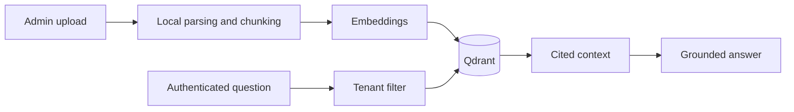

# Enterprise RAG

A production-minded, educational Retrieval-Augmented Generation service. It lets an administrator ingest documents and lets authenticated users ask grounded questions with citations.

## What is different from the basic project?

The basic RAG project teaches chunking and keyword search. This project adds a real HTTP API, semantic embeddings, a vector database, tenant isolation, role-based ingestion, document metadata, grounded generation, citations, audit logging, tests, container support, and evaluation guidance.

## Architecture



## Quick start

1. Create and activate a virtual environment.

```powershell
cd 'D:\Agentic AI\Enterprise Rag'
python -m venv .venv
.\.venv\Scripts\Activate.ps1
# PowerShell requires quotes because square brackets have special meaning there.
pip install -e '.[dev]'
Copy-Item .env.example .env
docker compose up -d qdrant
uvicorn enterprise_rag.main:app --reload
```

If your prompt looks like `D:\...>` (Command Prompt, as in the example below), use this equivalent command **without** single quotes:

```bat
pip install -e .[dev]
```

2. Add `OPENAI_API_KEY` to `.env`. The example contains two development bearer keys: `dev-admin-key` can upload and query; `dev-reader-key` can query only.

3. Open `http://127.0.0.1:8000/docs` to use the interactive API documentation.

## Angular web interface

The `web/` folder contains an Angular + TypeScript dashboard for uploading documents, asking questions, and inspecting source citations.

Start the FastAPI backend in one Command Prompt window:

```bat
uvicorn enterprise_rag.main:app --reload
```

Then open a second Command Prompt window, activate the same virtual environment if desired, and start Angular:

```bat
cd web
npm.cmd start
```

Open `http://localhost:4200`. Enter `dev-admin-key` in the **Bearer token** field to upload and query. The interface keeps this development token only in browser session storage, so it is removed when the tab is closed.

The backend explicitly permits only the local Angular origins through CORS. When deploying, replace those origins in `src/enterprise_rag/main.py` with your HTTPS frontend domain and replace the development tokens with OIDC/JWT authentication.

## Example calls

```powershell
curl.exe -X POST http://127.0.0.1:8000/v1/documents -H "Authorization: Bearer dev-admin-key" -F "file=@policy.pdf"
curl.exe -X POST http://127.0.0.1:8000/v1/query -H "Authorization: Bearer dev-reader-key" -H "Content-Type: application/json" -d '{"question":"What is the retention policy?"}'
```

## Learning path

Read the code in this order: `config.py`, `security.py`, `document_loader.py`, `chunking.py`, `vector_store.py`, `rag.py`, then `api/routes.py`. Every module has docstrings and inline comments explaining the non-obvious decisions.

## Production checklist

- Replace development API keys with OIDC/JWT validation and organization claims.
- Put API keys in a secret manager; rotate them and never commit `.env`.
- Enforce TLS, request rate limits, malware scanning, and content-type validation at the edge.
- Run evaluation datasets before releasing retrieval or prompt changes.
- Configure Qdrant backups, monitoring, retention, and deletion workflows.

See [architecture](docs/architecture.md), [sequence diagrams](docs/sequence-diagrams.md), [evaluation](docs/evaluation.md), and the candid [production-readiness guide](docs/production-readiness.md) for deeper guidance.
