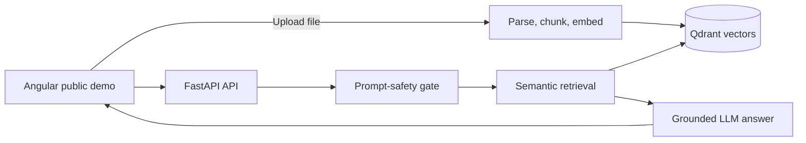

# Architecture

Each vector contains a `document_id`, filename, page number, chunk number, and text. A question searches the shared public library, optionally narrowed to specific document IDs.

This intentionally unauthenticated application is suitable only for a portfolio demo with non-confidential documents. Before accepting private documents or user-specific data, add an identity provider, per-user/organization authorization, and scoped vector filters.
