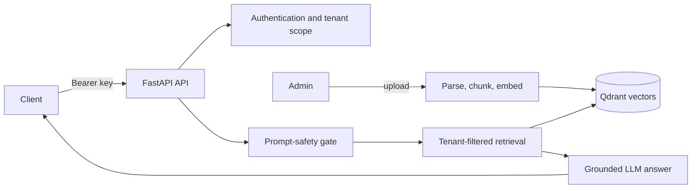

# Architecture

Each vector contains `tenant_id`, `document_id`, filename, chunk number, and text. The vector query always includes `tenant_id`, so a caller cannot retrieve another tenant's data merely by guessing a document identifier.

For production, use an identity provider to issue short-lived OIDC/JWT tokens, a managed Qdrant deployment with TLS, a secret manager, rate limiting at an API gateway, malware scanning before parsing, and centralized audit-log retention.
