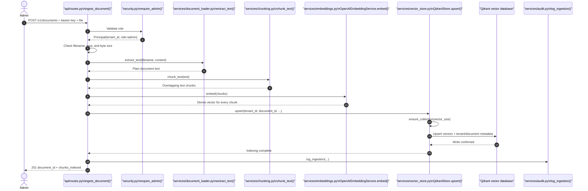
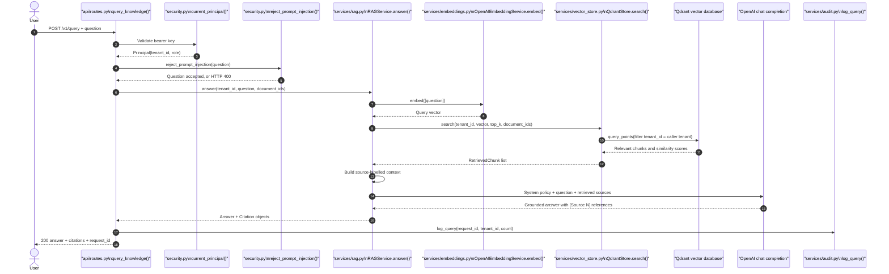
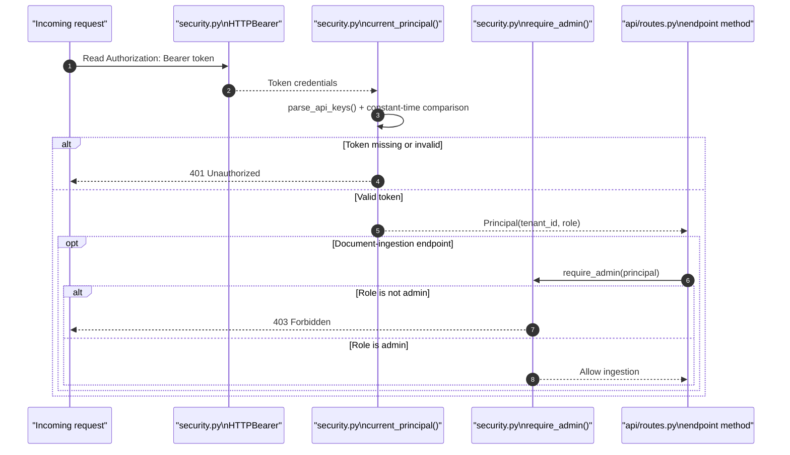

# Workflow Sequence Diagrams

These diagrams show the runtime order of the most important methods and the file that owns each method. Read them alongside the source code to connect the architecture to the implementation.

## 1. Document ingestion workflow

An administrator uploads one file. The API validates it, extracts its text, creates overlapping chunks, generates embeddings, and writes the chunks plus their tenant metadata to Qdrant.

Important security point: `QdrantStore.upsert()` stores the `tenant_id` on every chunk. This metadata is later mandatory in search filters.

## 2. Grounded question-answering workflow

A reader asks a question. The service validates the caller, screens obvious prompt attacks, searches only the caller's tenant data, then asks the LLM to answer from retrieved sources.

If Qdrant returns no chunks, `RAGService.answer()` does **not** call the LLM. It returns a clear “no supporting information” response instead of encouraging an ungrounded answer.

## 3. Authentication and authorization decision

The `API_KEYS` mechanism is intentionally simple for local learning. In a real deployment, replace `current_principal()` with OIDC/JWT verification and take the tenant and role claims from the identity provider.

## File-to-workflow map

| File | Main responsibility | Key method(s) |
|---|---|---|
| `src/enterprise_rag/api/routes.py` | HTTP endpoints and request orchestration | `ingest_document()`, `query_knowledge()` |
| `src/enterprise_rag/security.py` | Authentication, roles, initial prompt safety | `current_principal()`, `require_admin()`, `reject_prompt_injection()` |
| `src/enterprise_rag/services/document_loader.py` | Reads supported document formats | `extract_text()` |
| `src/enterprise_rag/services/chunking.py` | Produces overlap-aware chunks | `chunk_text()` |
| `src/enterprise_rag/services/embeddings.py` | Turns text into semantic vectors | `OpenAIEmbeddingService.embed()` |
| `src/enterprise_rag/services/vector_store.py` | Tenant-filtered vector persistence/search | `QdrantStore.upsert()`, `QdrantStore.search()` |
| `src/enterprise_rag/services/rag.py` | Retrieval and grounded answer generation | `RAGService.answer()` |
| `src/enterprise_rag/services/audit.py` | Metadata-only audit events | `log_ingestion()`, `log_query()` |
| `src/enterprise_rag/config.py` | Environment-backed configuration | `get_settings()` |
