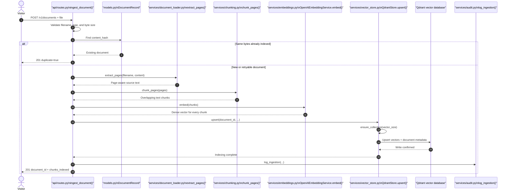
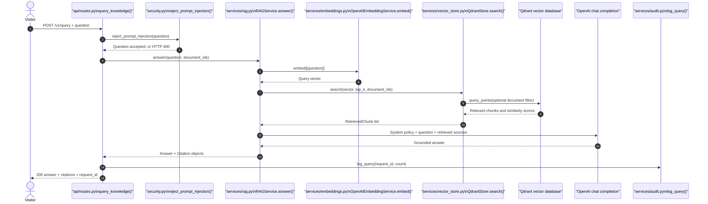

# Workflow Sequence Diagrams

These diagrams show the runtime order of the most important methods and the file that owns each method. Read them alongside the source code to connect the architecture to the implementation.

## 1. Document ingestion workflow

A visitor uploads one non-confidential file. The API validates it, detects duplicate file bytes, extracts its text, creates overlapping chunks, generates embeddings, and writes the chunks to Qdrant.

## 2. Grounded question-answering workflow

A visitor asks a question. The service screens obvious instruction overrides, retrieves relevant chunks from the shared library, then asks the LLM to answer only from that evidence.

If Qdrant returns no chunks, `RAGService.answer()` does **not** call the LLM. It returns a clear “no supporting information” response instead of encouraging an ungrounded answer.

## File-to-workflow map

| File | Main responsibility | Key method(s) |
|---|---|---|
| `src/enterprise_rag/api/routes.py` | Public HTTP endpoints and request orchestration | `ingest_document()`, `query_knowledge()` |
| `src/enterprise_rag/security.py` | Prompt-safety gate | `reject_prompt_injection()` |
| `src/enterprise_rag/services/document_loader.py` | Reads supported document formats | `extract_pages()` |
| `src/enterprise_rag/services/chunking.py` | Produces page-aware, overlap-aware chunks | `chunk_pages()` |
| `src/enterprise_rag/services/embeddings.py` | Turns text into semantic vectors | `OpenAIEmbeddingService.embed()` |
| `src/enterprise_rag/services/vector_store.py` | Vector persistence and search | `QdrantStore.upsert()`, `QdrantStore.search()` |
| `src/enterprise_rag/services/rag.py` | Retrieval and grounded answer generation | `RAGService.answer()` |
| `src/enterprise_rag/services/audit.py` | Metadata-only audit events | `log_ingestion()`, `log_query()` |
